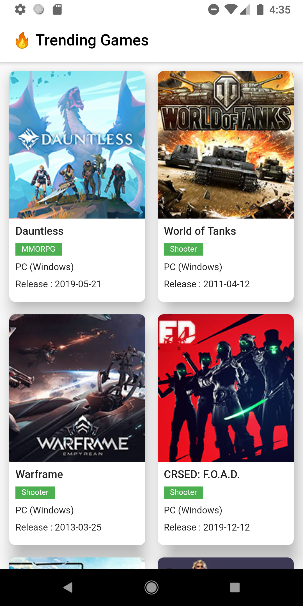
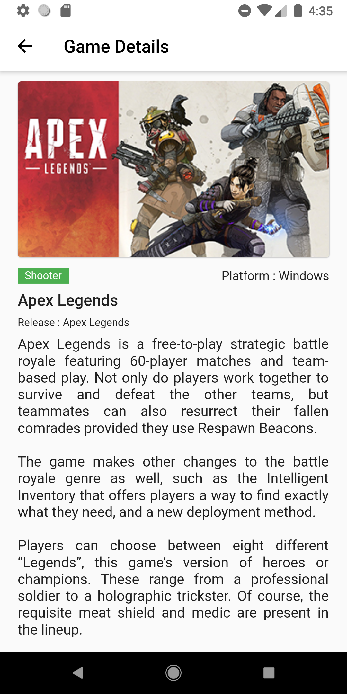

# Free to Game

A Experimental Flutter application.

## Overview
|   Trending Games   | Game Details |
|     :---:      |     :---:      |
|      |      |

<br/>

## API
Go to the [Free-To-Play Games Database API](https://www.freetogame.com/api-doc) to explore api.

## Contributors
Feel free to contribute in any way to the project from typos in docs to code review are all welcome.

## License

 ```
   Copyright 2021 Musfick Jamil
   
   Licensed under the Apache License, Version 2.0 (the "License");
   you may not use this file except in compliance with the License.
   You may obtain a copy of the License at

       http://www.apache.org/licenses/LICENSE-2.0

   Unless required by applicable law or agreed to in writing, software
   distributed under the License is distributed on an "AS IS" BASIS,
   WITHOUT WARRANTIES OR CONDITIONS OF ANY KIND, either express or implied.
   See the License for the specific language governing permissions and
   limitations under the License.
 ```

